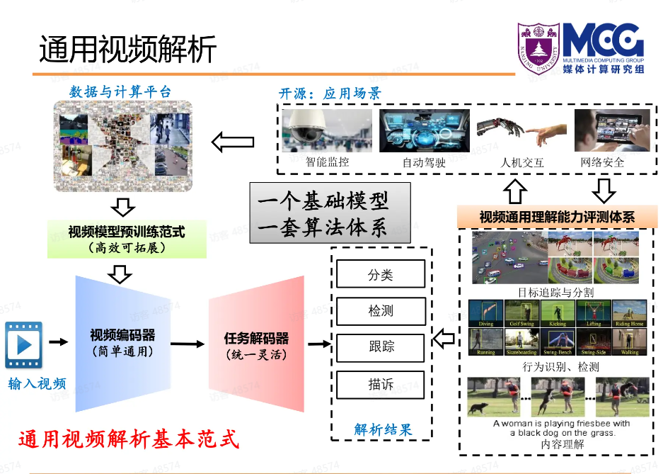

# 😛视频理解🥵资源小站
收集视频理解领域的在线资源。

## 综述
（2022-06-12）[视频理解综述：动作识别、时序动作定位、视频Embedding](https://zhuanlan.zhihu.com/p/422235052)

（2023-05-17）[视频理解基础模型及下游应用-王利民教授 | AI奇妙夜#7](https://www.bilibili.com/video/BV1rz4y1t7b7/?spm_id_from=333.999.0.0&vd_source=6ac7c4e9791ca84c0eeb7af7f2237d31)，
[PPT链接](https://aicarrier.feishu.cn/file/AVZQbWGi7ooyiuxHbLUcPOKknad)

（2022-04-15）[视频理解论文串讲（上）| 跟李沐学AI](https://www.bilibili.com/video/BV1fL4y157yA/?spm_id_from=333.337.search-card.all.click&vd_source=6ac7c4e9791ca84c0eeb7af7f2237d31)

（2022-04-29）[视频理解论文串讲（下）| 跟李沐学AI](https://www.bilibili.com/video/BV11Y411P7ep/?spm_id_from=333.788&vd_source=6ac7c4e9791ca84c0eeb7af7f2237d31)

（2020-07-11）[万字长文漫谈视频理解](https://zhuanlan.zhihu.com/p/158702087)

（2020-12-05）[工业界视频理解解决方案大汇总](https://zhuanlan.zhihu.com/p/331660909)

## 入门
[【OpenMMLab 公开课】视频理解与 MMAction2](https://www.bilibili.com/video/BV1h34y1D7QH?p=1&vd_source=6ac7c4e9791ca84c0eeb7af7f2237d31)

[《深度学习视频理解》张皓](https://zhuanlan.zhihu.com/p/413690166)

## 重要工作
### 主干网络（Backbone）
（2014）双流CNN：[Two-Stream Convolutional Networks for Action Recognition in Videos](https://github.com/wwsyan/video_understanding_store/blob/main/paper/Backbone/Two_Stream_ConvNet.pdf)

（2015）C3D：[Learning Spatiotemporal Features with 3D Convolutional Networks](https://github.com/wwsyan/video_understanding_store/blob/main/paper/Backbone/3D_ConvNet.pdf)

（2016）TSN：[Temporal Segment Networks: Towards Good Practices for Deep Action Recognition](https://github.com/wwsyan/video_understanding_store/blob/main/paper/Backbone/TSN.pdf)

（2018）Non-local Net：[Non-local Neural Networks](https://github.com/wwsyan/video_understanding_store/blob/main/paper/Backbone/Non-local%20NN.pdf)

（2021）TAM：[TAM: Temporal Adaptive Module for Video Recognitio](https://github.com/wwsyan/video_understanding_store/blob/main/paper/Backbone/TAM.pdf)

（2021）TDN：[TDN: Temporal Difference Networks for Efficient Action Recognitio](https://github.com/wwsyan/video_understanding_store/blob/main/paper/Backbone/TDN.pdf)

（2021）TimeSformer：[Is Space-Time Attention All You Need for Video Understanding?](https://github.com/wwsyan/video_understanding_store/blob/main/paper/Backbone/TimeSformer.pdf)

### 预训练方法（Pretraining）
（2022）VideoMAE：[VideoMAE: Masked Autoencoders are Data-Efficient Learners for Self-f-Supervised Video Pre-Training](https://github.com/wwsyan/video_understanding_store/blob/main/paper/Pretraining/VideoMAE.pdf)

（2023）VideoMAE-V2：[VideoMAE V2: Scaling Video Masked Autoencoders with Dual Masking](https://github.com/wwsyan/video_understanding_store/blob/main/paper/Pretraining/VideoMAE_V2.pdf)

## 重点关注
[张皓的知乎主页](https://www.zhihu.com/people/hao-zhang-0214)，《深度学习视频理解》的作者。

[王利民的主页](http://wanglimin.github.io/)，南京大学博导，产出多个重量级工作。

[OpenMMLab](https://github.com/open-mmlab)，最好的开源计算机视觉应用库。

## 开源项目精选
最好的视频理解工具箱：[mmaction2](https://github.com/open-mmlab/mmaction2)。

视频多模对话 VideoChat：[Ask-Anything](https://github.com/OpenGVLab/Ask-Anything)。
